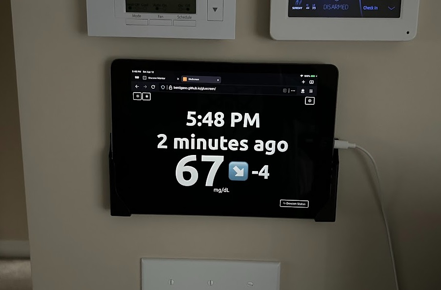

# GluScreen: Private CGM Dashboard

A lightweight, privacy-focused web application that displays real-time Dexcom Continuous Glucose Monitor (CGM) readings on a screen or tablet — perfect for bedside tables, kitchen counters, wall-mount tablets, or desk setups. Perfect for old iPads or Kindles that don't run other apps well.

## 🛡️ Why Privacy Matters

Unlike many third-party apps, **GluScreen** does **not** send your data to the cloud or third-party servers. All data is retrieved and displayed **locally** in your browser. Your glucose data stays **yours** and goes directly from Dexcom to your device.

## 🚀 Features

- 📊 Real-time CGM data display for Dexcom
- 💻 Optimized for all devices, including older tablets
- 🔒 Local-only for maximum privacy
- 🌙 Customizable brightness for comfortable viewing
- 🔄 Auto-refresh every 5 minutes
- 📱 Responsive UI for all screen sizes

## 🛠️ How It Works

**GluScreen** captures your Dexcom credentials (username and password) and stores those behind-the-scenes in your browser. With those, it fetches CGM readings via direct connection to the same Dexcom data source used by the Dexcom Follow app.

Data is processed right in your browser and displayed in a simple, easy-to-read dashboard.

Google Analytics is used **ONLY** for tracking page views. Dexcom credentials and CGM data **NEVER** leave your browser window.

## 📦 Setup

1. Navigate to https://bentigano.github.io/gluscreen
1. Enter your Dexcom credentials
1. Repeat on each device you want to use as a private CGM dashboard
1. Enjoy!

## 👤 About the Author

This project was created by the father of a  **type 1 diabetic**, driven by a personal need for a simple, private way to view CGM data without compromising security or relying on big tech ecosystems. While other companies offer similar products, the reliability and responsiveness weren't meeting my needs or my budget - insulin, CGM's, and pumps are expensive enough.

GluScreen is offered **completely free** for other T1D's and their parents, partners, and caregivers who want CGM readings front and center so the best care can be provided at all times with minimal effort.

> “I built this because I needed it. If it helps make your day a little easier or your night a little more restful, then it’s done its job.”

Feel free to fork, contribute, or just use it as-is — no strings attached.

Want to say thanks or share how you're using it? Open an issue or drop a message in the Discussions tab!

Want to donate or buy me a coffee? Too bad. 😏

## Sample Screenshots:

#### Example Wall Display using an old iPad that won't hold a charge or run anything except a web browser:
